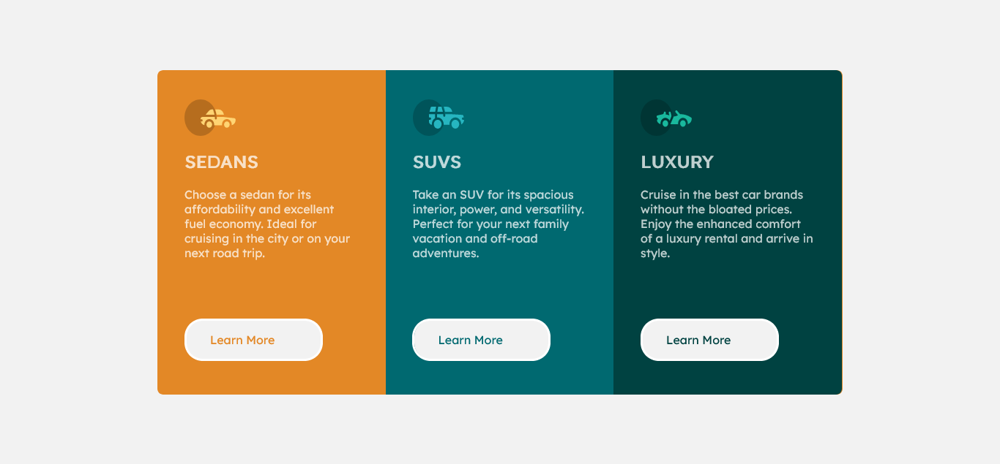
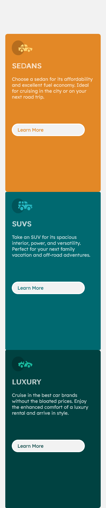

# Frontend Mentor - 3-column preview card component solution

This is a my solution to the [3-column display challenge](https://www.frontendmentor.io/challenges/3column-preview-card-component-pH92eAR2-) on Frontend Mentor. 

## Table of contents

- [Overview](#overview)
  - [The challenge](#the-challenge)
  - [Screenshot](#screenshot)
  - [Links](#links)
- [My process](#my-process)
  - [Built with](#built-with)
  - [What I learned](#what-i-learned)
- [Author](#author)

## Overview

### The challenge

Users should be able to:

- View the optimal layout depending on their device's screen size
- See hover states for interactive elements

### Screenshot

#### Desktop view

#### Mobile view

### Links

- Solution URL: [Source Code](https://github.com/VincentX33/three-column-display-challenge)
- Live Site URL: [Live Site](https://vincentx33.github.io/three-column-display-challenge/)

## My process

### Built with

- Semantic HTML5 markup
- CSS custom properties
- Flexbox
- CSS position
- CSS floats
- @media queries

### What I learned

Usually, I'd been using flexbox, but in this, I got out of my comfort zone and used floats. Improved my skill at using position property. Got better at achieving responsive design.

## Author

- Frontend Mentor - [@VincentX33](https://www.frontendmentor.io/profile/VincentX33)
- Twitter - [@V1nceeeent](https://www.twitter.com/V1nceeeent/)
- Hashnode - [@VincentDsouza](https://hashnode.com/@VincentDsouza)
